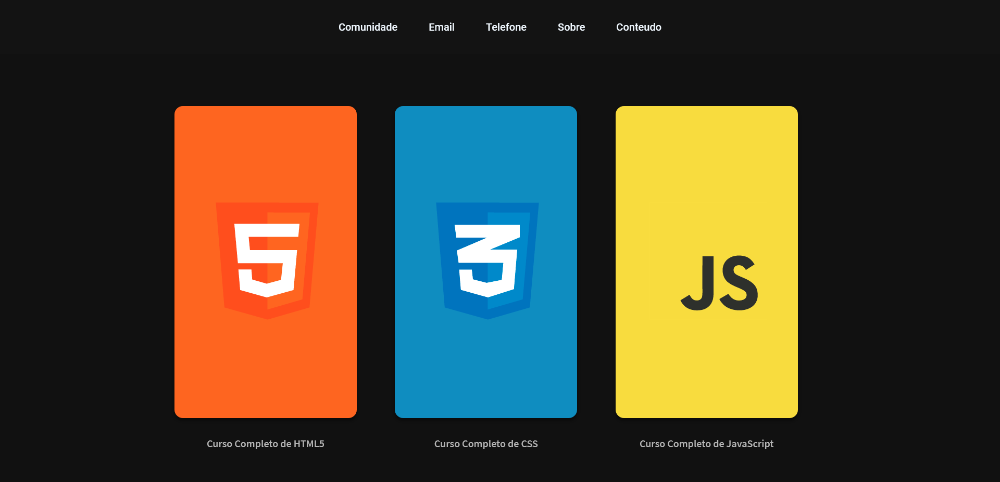
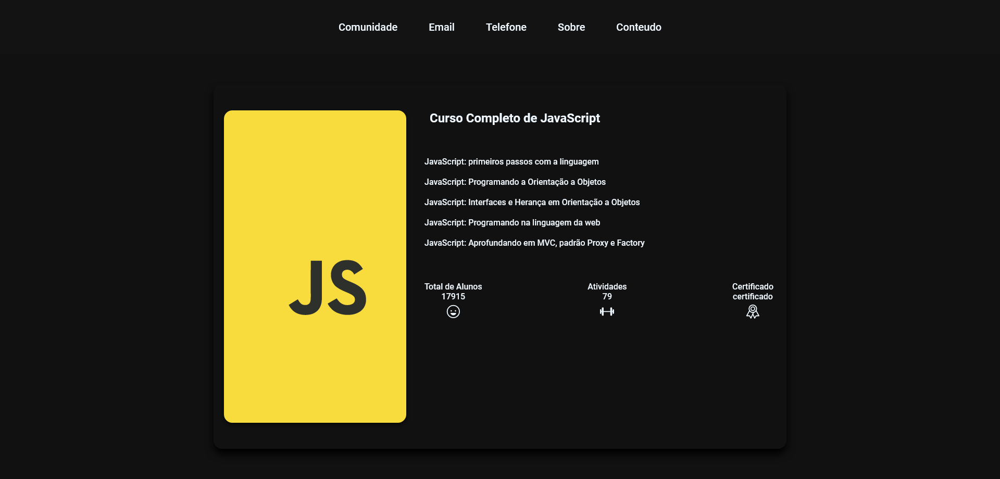

## :rocket: Sobre o desafio:3-1

Nesse desafio criei um servidor que tem duas rotas que devem retornar o conteúdo dos html gerados no desafio 2-3 (páginas de `Cursos` e `Sobre`). Além disso, deve ser implementando um arquivo padrão (layout.njk) que reaproveite o código em comum entre esses dois e também um arquivo que sirva uma página de erro 404.

_Erro 404 é comum aparecer em páginas da internet, quando não foi encontrado nenhum conteúdo._

## Técnologia usada no desafio

-  HTML

-  CSS

-  JavaScript

-  Node ( é necessário baixar )

-  Express

-  Nunjucks

 

É necessário usar o comando <code>npm install express</code> e <code>npm install nunjucks</code>

### Arquivos HTML

-  `conteudo.njk`: Arquivo referente à pagina de conteúdos, /content
-  `about.njk`: Arquivo referente à pagina de descrição, /about
-  `layout.njk`: Arquivo referente à base comum entre as páginas.
-  `not-found.njk`: Arquivo referente à pagina de erro 404, para quando o usuário digitar um caminho não especificado

   -  Layout.njk como base
   -  Ter um texto informativo sobre o erro

    
    

## :rocket: Sobre o desafio:3-2

Nesse desafio foi atualizado a maneira em que os arquivos com informações de cursos e descrição serão exebidos, agora de forma dinâmica.

## Mudança

Foi acresentado um arquivo na raiz do projeto `data.js` que agora contem as irfomação dos cursos

    
    

## :rocket: Desafio 3-3: Página de descrição do curso

Nesse desafio foi criada uma nova página de descrição do curso que será chamada no lugar da modal quando o usuário clicar no card do curso.

## Mudanças

Foi acresentado um arquivo na pasta de `views/conteudo` `curso.njk`

-  `curso.njk` o arquivo que contem as descrições dos cursos.

-  Foi crido um novo arquivo na raiz do projeto chamado `curso.js` responsável agora por fornecer os dados

-  `conteudo.njk` passa receber agora os dados do arquivo `cursos.js` e não mais do `data.js` e também tem uma nova estilização

## Demonstração

   
   

